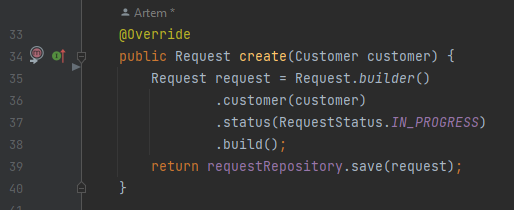
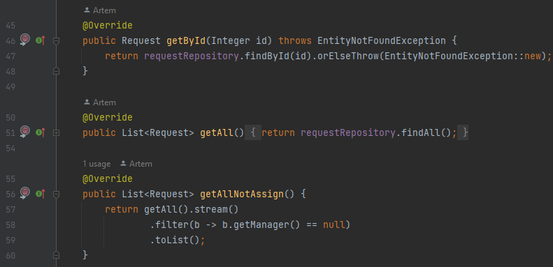
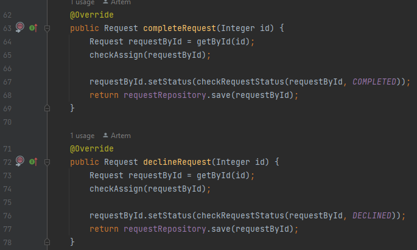
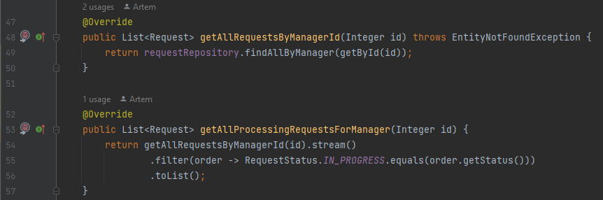
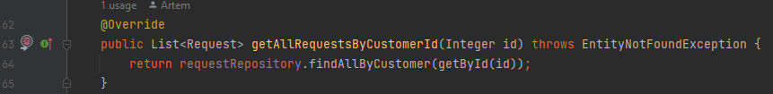
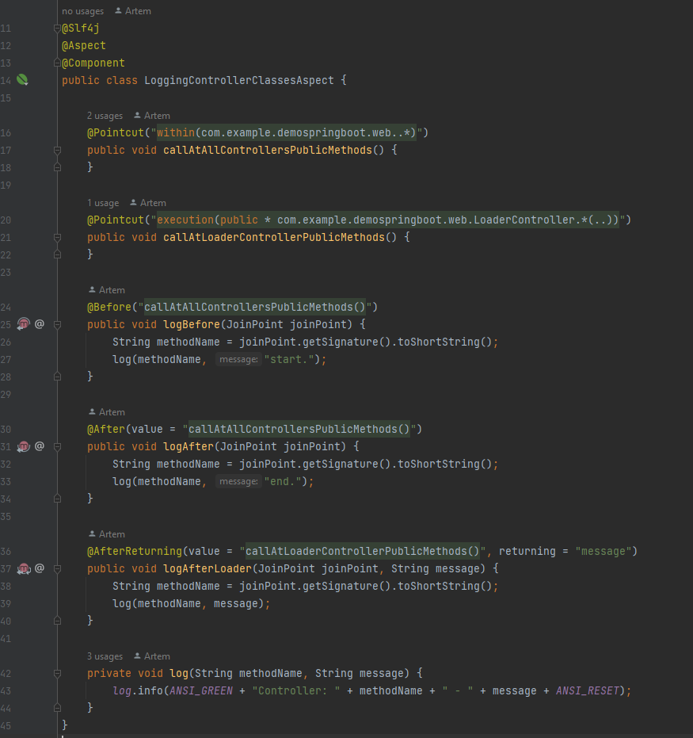
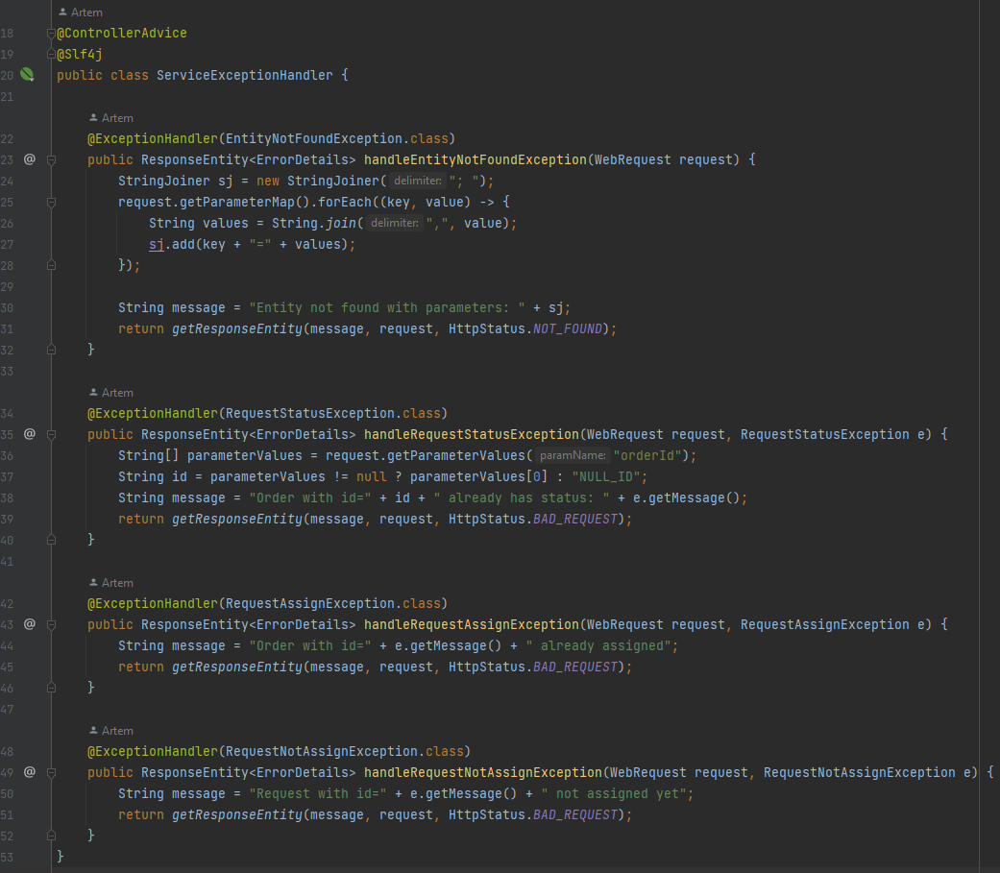

## **DEMO PROJECT**

### Основне завдання програми:

- При створенні нового замовлення покупцем воно отримує статус "В роботі" та зберігається в базу даних.

- Можна отримати з бази даних всі замовлення або одне, а також всі, що мають тільки статус "В роботі".

- Статус замовлення може бути змінено на "Закінчене" або "Відхилено".

- Менеджер може отримати всі свої замовлення або тільки ті, що мають статус "В роботі".

- Покупець може отримати свої замовлення.

### Додатковий опис:

- Для логування використовується АОП. Всі класи з пакету 'web' логуються на рівні 'info', а всі класи 'service' - на рівні 'debug'.

- При виникненні виключення під час роботи сервісів, формуються повідомлення за допомогою @ControllerAdvice та @ExceptionHandler.

